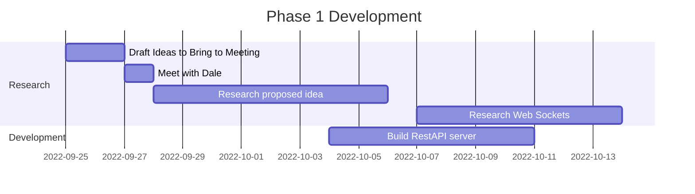

# Individual Project – Integrated Voting Within PowerPoint

## Acknowledgements

I would like to thank my amazing project supervisor Allan Callaghan for all his help and support throughout the project.

## Table of Contents

- [Individual Project – Integrated Voting Within PowerPoint](#individual-project--integrated-voting-within-powerpoint)
  - [Acknowledgements](#acknowledgements)
  - [Table of Contents](#table-of-contents)
  - [Introduction](#introduction)
  - [Problem Analysis](#problem-analysis)
    - [Literature review](#literature-review)
      - [Talk less Teaching](#talk-less-teaching)
      - [Technology and the Modern Classroom](#technology-and-the-modern-classroom)
    - [Existing Similar Solutions](#existing-similar-solutions)
      - [Mentimeter](#mentimeter)
      - [Poll Everywhere](#poll-everywhere)
      - [Kahoot](#kahoot)
    - [User Stories](#user-stories)
  - [Phase 1 Development](#phase-1-development)
  - [Phase 2 Development](#phase-2-development)
  - [Phase 3 Development](#phase-3-development)
  - [Final Deliverable](#final-deliverable)
    - [Evaluation](#evaluation)
  - [Conclusion](#conclusion)
  - [References](#references)
  - [Appendices](#appendices)
    - [Table of Appendices](#table-of-appendices)
    - [Meeting Notes](#meeting-notes)
    - [Communication History](#communication-history)

## Introduction

With our modern-day society with technology and our increasingly fast paced lifestyle, it is becoming difficult to hold the attention of students while teaching (Consumer Insights, 2015). The aim of this project is to increase interactivity within lessons, without having to break the flow of the lesson, which could introduce disruption and slow down learning. My application will be a web-based voting tool that can be implemented directly within a PowerPoint presentation. It will accept votes from students on their individual devices and they will appear live in an active presentation, no need to switch windows or utilize external tools.

## Problem Analysis

This solution was conceptualized working with the head of ICT at Sir Rodger Manwood's school. He wanted a way to increase interactivity within his lessons, without having to break the flow of the lesson, which could introduce disruption and slow down learning. He wanted a way to be able to ask questions to his students and get live feedback from them, without having to switch windows or utilize external tools.

This is not only a good solution for just our client, but could be useful for teachers around the country. With PowerPoint being a staple in the modern classroom, this tool would easily integrate within the teachers current workflow and minimal additional knowledge would be required to use it. This is hugely beneficial as with marking and planning teachers have very little time to learn new tools and software.

To enable software to reach as many users as possible this software would be free with available extras at a monthly cost. Examples of some of extras could be, an unlimited amount of questions being created a day, or the ability to customize the color scheme to better suit the presentation. This would generate ongoing revenue for the company and would allow for the software to be maintained and updated.

### Literature review

#### Talk less Teaching

The main concept behind 'Talk Less Teaching' is to increase the amount of time students are actively engaged in the lesson. This is done by reducing the amount of time the teacher is talking (Wallace, 2014). This gives the students time to not only absorb the information that has just been presented to them, but also develop their own understanding of the material.

#### Technology and the Modern Classroom

Why and how is technology being used in the classroom. What are the benefits of using technology in the classroom.

Yes the stakeholder does tell you what to do but the stakeholder tells you what path to go down.

### Existing Similar Solutions

Some commercial solutions are already pre-existing and an analysis of such can be found below.

#### Mentimeter

#### Poll Everywhere

#### Kahoot

Mentimeter, Poll everywhere, Kahoot

### User Stories

- As a Student I want to be able to see the question that I am voting on, on my device so that I do not have to look up at the screen, so that I can focus on the question at hand.

- As a classroom teacher, I would like to be able to add the vote to my presentations before the vote starts so that they are ready to be used in the lesson and can be added during my planning time.

- As a teacher I would like for the voting application to have a simple look, as to not distract students away from the focus of the lesson.

- As a teacher I would like to be able to see the results of the vote in real time, so that the students can see their votes having an impact on the final tally.

- As a student I would like a qr code to take me to the website, so that it is easily accessible from my mobile device without having to type in a long URL.

## Phase 1 Development

//write about hardware, eg. phones computers. What version of powerpoint does it actually work on?

After the meeting with Dale, we were able to determine a tool that would complement his teaching. The proposed idea was to make a voting system that would work within PowerPoint and would display feedback from students live within the presentation. We were unsure whether to make the method of voting a hardware-based device or a web-based client, but eventually settled on a web-based client due to the complexity and cost of a hardware-based solution.

The first issue I encountered was being able to import webpages into PowerPoint. In older versions of PowerPoint using embedded objects was supported but has since been discontinued and made obsolete.

Researching ways to display webpages within PowerPoint was the first step. I found several executables online that promised to add live webpage functionality within Powerpoint, but they all seemed to only work with older versions of PowerPoint, which would have been no use to me as they were obsolete. I did not like this solution much also, due to the nature of having to install and trust someone else’s software within a sensitive environment like a school. This was when I stumbled upon the add in for PowerPoint called "Web Viewer" an official microsoft extension. The add-in promised to work with the latest version of PowerPoint which was perfect for my use case. Due to it being an official microsoft add-in, it was easily installable from the add-in store in PowerPoint. This I felt like was the most appropriate route to take, in terms of user experience, ease of installation and security.

With Web Viewer added to my PowerPoint installation, I was ready and excited to start. Before I installed Web Viewer, I had read some of the reviews contributing to the 1.9 out of 5 stars it has on the Microsoft store. “Doesn’t work with basic sites”, “Waste of time” and “Next to useless” (Microsoft Corporation, 2023) were just a few of the reviews I read. I wanted to ensure that I wasn’t going to have the same experience that those users had, so I loaded up a blank presentation, added the add in and typed in "www.google.com". Nothing. Maybe it doesn’t work with search engines I thought, so I navigated to "www.canterbury.ac.uk" still nothing. I had a problem. I noticed that it had a default URL in the search bar of "www.wikipedia.org" so I tried that and it worked.

Now I just had to figure out why that worked, and the others didn’t. I made a basic Hello world webpage and hosted it on a web server that supported HTTPS. There it was it showed up.
Ensuring Web Viewer Supported WebSocket’s was critical for my project, I added a simple web socket script to my Hello World page, that would just display on the page what it received. I sent the message and nothing. I tried it on my browser, and it worked. Web Viewer has no developer tools and no console, so I had no method of any feedback as to why it was not working. After a lot of trial and error I worked out that it required secure WebSocket’s. After setting up a domain to utilise secure WebSocket’s the messages appeared within Web Viewer.

## Phase 2 Development

## Phase 3 Development

## Final Deliverable

### Evaluation

## Conclusion

I think even though this project didn't reach all of its goals, I still believe it was a huge success, as its main aim was to aid in learning, and throughout this project I have learnt many new skills

## References

- Microsoft Corporation, 2023. Web Viewer. [Online] Available at: <https://appsource.microsoft.com/en-us/product/office/WA104295828?tab=Reviews&exp=ubp8#>
 (Accessed on 2023-04-25)
- Consumer Insights, 2015. Attention spans, s.l.: Microsoft Canada, Spring.
- Wallace, I., 2014. Talk-less teaching: practice, participation and progress. Crown House Publishing.

## Appendices

### Table of Appendices

- [Meeting Notes](#meeting-notes)
- [Communication History](#communication-history)

### Meeting Notes

### Communication History
