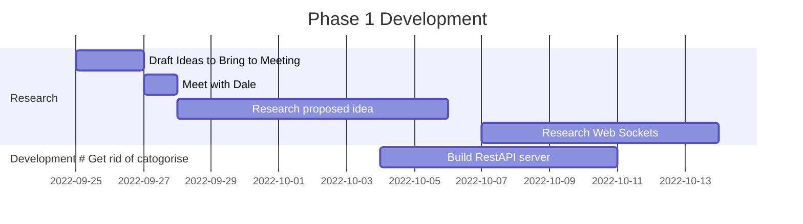

# Individual Project – Integrated Voting Within PowerPoint

## Acknowledgements

I would like to thank my amazing project supervisor Allan Callaghan for all his help and support throughout the project. Thank you also to Sir Rodger Manwood's School for allowing me to work with them on this project.

## Table of Contents

- [Individual Project – Integrated Voting Within PowerPoint](#individual-project--integrated-voting-within-powerpoint)
  - [Acknowledgements](#acknowledgements)
  - [Table of Contents](#table-of-contents)
  - [Abstract](#abstract)
  - [Introduction](#introduction)
  - [Problem Analysis](#problem-analysis)
    - [Aims](#aims)
    - [Objective](#objective)
    - [Scope of the project](#scope-of-the-project)
    - [Outside of the scope of the project](#outside-of-the-scope-of-the-project)
    - [Literature review](#literature-review)
      - [Talk less Teaching](#talk-less-teaching)
      - [Technology and the Modern Classroom](#technology-and-the-modern-classroom)
    - [Existing Similar Solutions](#existing-similar-solutions)
      - [Mentimeter](#mentimeter)
      - [Poll Everywhere](#poll-everywhere)
      - [Kahoot](#kahoot)
    - [User Profiles](#user-profiles)
    - [User Stories](#user-stories)
  - [Phase 1 Development](#phase-1-development)
    - [Challenges](#challenges)
      - [Importing webpages into PowerPoint](#importing-webpages-into-powerpoint)
      - [WebViewer Limitations](#webviewer-limitations)
      - [Websockets](#websockets)
    - [Successes](#successes)
      - [WebViewer add in for PowerPoint](#webviewer-add-in-for-powerpoint)
      - [Viewing a webpage in WebViewer](#viewing-a-webpage-in-webviewer)
      - [RestAPI Server](#restapi-server)
      - [Containerizing the RestAPI](#containerizing-the-restapi)
      - [Receiving Websockets](#receiving-websockets)
    - [Milestone Retrospective](#milestone-retrospective)
      - [Short Term Learnings](#short-term-learnings)
      - [Long Term Learnings](#long-term-learnings)
  - [Phase 2 Development](#phase-2-development)
    - [Challenges](#challenges-1)
      - [Chart.JS Library](#chartjs-library)
    - [Successes](#successes-1)
      - [Design](#design)
      - [Chart.JS v2](#chartjs-v2)
      - [Websockets to votes](#websockets-to-votes)
    - [Phase 2 Evaluation](#phase-2-evaluation)
      - [Short Term Learnings](#short-term-learnings-1)
      - [Long Term Learnings](#long-term-learnings-1)
  - [Phase 3 Development](#phase-3-development)
  - [Final Deliverable](#final-deliverable)
    - [Evaluation](#evaluation)
    - [Future Work](#future-work)
  - [Conclusion](#conclusion)
  - [References](#references)
  - [Appendices](#appendices)
    - [Links to Repositories](#links-to-repositories)
    - [Meeting Notes](#meeting-notes)
    - [Communication History](#communication-history)

## Abstract

// Try to seperate the implimentation details - Sperate the what from the how. In ssoftware enjneering we create solutions for problems. Dale wants to engage the students more, not that he wants it in powerpoint

## Introduction

This proof of concept project, working in collaboration with Sir Rodger Manwood's School, is designed to engage students more within the classroom. The aim is to design a seamlessly integrated participation tool that can easily fit into a teachers existing workflow to help students to focus more within the classroom. Having to navigate to a separate website or application to participate in a lesson can be disruptive and can slow down the flow of the lesson.

With our modern-day society with technology and our increasingly fast paced lifestyle, it is becoming difficult to hold the attention of students while teaching (Consumer Insights, 2015). The aim of this project is to increase interactivity within lessons, without having to break the flow of the lesson, which could introduce disruption and slow down learning. My application will be a web-based voting tool that can be implemented directly within a PowerPoint presentation. It will accept votes from students on their individual devices and they will appear live in an active presentation, no need to switch windows or utilize external tools.
// Use Bullet points to make points, convey why those decides were made. from an engineering perspective.

## Problem Analysis

This solution was conceptualized working with the head of ICT at Sir Rodger Manwood's secondary school. He wanted a way to increase interactivity within his lessons, without having to break the flow of the lesson, which could introduce disruption and slow down learning. A tool to be able to ask questions to his students and get live feedback from them, without having to switch windows or utilize external tools. This will be a prototype to prove the concept, not a full commercial solution, and I will be working incrementally with the teacher to get feedback and improve the solution.

### Aims

The aim of this project is to increase student participation within the lesson without disrupting the flow of the lesson. The solution should be accessible for both the teacher and the students, and should be easily integrated within the teachers existing workflow. The solution should be able to be used by teachers with minimal additional training and should be able to be used by students with no additional training.

// Bulletpoints for aims and objectives. Things in scope and not in scope. Do not assume the, the reader is not me.

### Objective

The objective of this project is to create a voting tool that is easily accessible and can integrate within the teachers existing workflow, in this case a voting tool that is accessible within PowerPoint.

// Intergation with existing workflow
// Classroom context, No logins needed
// What are you using
// Avoid Lengthy login processes

Reference educational theory about involving them

### Scope of the project

This is not only a good solution for just our client, but could be useful for teachers around the country. With PowerPoint being a staple in the modern classroom, this tool would easily integrate within the teachers current workflow and minimal additional knowledge would be required to use it. This is hugely beneficial as with marking and planning teachers have very little time to learn new tools and software.

To enable software to reach as many users as possible this software would be free with available extras at a monthly cost. Examples of some of extras could be, an unlimited amount of questions being created a day, or the ability to customize the color scheme to better suit the presentation. This would generate ongoing revenue for the company and would allow for the software to be maintained and updated.

### Outside of the scope of the project

These are outside of the scope of this project but could be considered in the future.

- Security and logins
- Monetization
- Integration with other presentation software
- Different chart types
- Ability to add images to questions
- Customization of the color scheme and layout

Monetization is out of scope - consider in conclusion.

### Literature review

#### Talk less Teaching

The main concept behind 'Talk Less Teaching' is to increase the amount of time students are actively engaged in the lesson. This is done by reducing the amount of time the teacher is talking (Wallace, 2014). This gives the students time to not only absorb the information that has just been presented to them, but also develop their own understanding of the material.

#### Technology and the Modern Classroom

Technology is an essential tool for teaching and learning in the 21st century (Muir-Herzig, 2004)

Why and how is technology being used in the classroom. What are the benefits of using technology in the classroom.

Yes the stakeholder does tell you what to do but the stakeholder tells you what path to go down.

### Existing Similar Solutions

Some commercial solutions are already pre-existing and an analysis of such can be found below.

#### Mentimeter

Mentimeter is a response tool that allows for the creation of interactive presentations. It allows for the creation of polls, quizzes, word clouds and more. It is a web-based application that has a free beginning tier, that has limitations on its usage but is available as a paid service (Iona,2018). It allows live responses to open questions.

> Screenshots of the application:
> Mentimeter Presentation Display             |  Mentimeter Voting Display
> :-------------------------:|:-------------------------:
>  | 

Features of the product:

- Menti allows the creation of presentations that have audience participation.
- It has the ability to create polls, quizzes, word clouds and more.
- Customisable themes and layouts.

Limitations:

- It doesn't seamlessly integrate into existing workflows, you have to switch to a web browser.
- No QR code to join support.

// Include screenshots of the application
// Limitations

Break down what it is these solutions are doing.

You focused on these features, becuase.

Could it integrate into a spreadsheet.

What is the problem how will it nbe used

#### Poll Everywhere

Poll Everywhere is a web-based application 

> Screenshots of the application:
> Poll Everywhere Presentation Display             | Poll Everywhere Voting Display
> :-------------------------:|:-------------------------:
>  | 
>
> ---
>
> <p align="center"><b>Poll Everywhere In PowerPoint</b></p>
>
> ---
> 
> 

Features of the product:

- Poll Everywhere integrates into PowerPoint
- Has the ability to text in, to answer questions. Useful for situations with no internet access.

Limitations:

- Doesn't have easy joining with QR codes
- Requires administrator privileges to install separate executable application to work with PowerPoint

#### Kahoot

Kahoot is a game-based learning solution (Wang, 2020) that allows users to create quizzes and games for students to play. It is a web-based application that has a free beginning tier, that has limitations on its usage but is available as a paid service with enhanced features such as team vs team modes (Kahoot, 2020).

> Screenshots of the application:
> Kahoot Joining Screen            |  Kahoot Mobile Display
> :-------------------------:|:-------------------------:
>  | 
> <b>Kahoot Joined Member Screen</b> | <b>Kahoot Answer Screen</b>
>  | 
>
> ---
>
> <p align="center"><b>Kahoot Question Screen</b></p>
>
> ---
>
> 

Features of the product:

- Kahoot allows the creation of quizzes and games.
- Has a leaderboard for students to see their progress.

Limitations:

- It doesn't seamlessly integrate into existing workflows, you have to switch to a web browser.
- The question is not shown on the device of the user, they have to look up at the screen to see the question.

### User Profiles

- Student
- Classroom Teacher - Delivering the lesson
- Person Setting up lesson (Heaad of depatment?)
- How the data is used, senior leadership team
- Number suer requirements

### User Stories

// Need to be more specific //So that is KEY //List how we will know when we have achieved the user story question on the device needs to be synchronized while the lesson is in progress. The user doesn't actively need to select the question.

//Include criteria for success. Link each user story to objective or aim.

// Size tickets

See the question on their device sychronized with the presentation.

1. As a Student I want to be able to see the question that I am voting on, on my device so that I do not have to look up at the screen, so that I can focus on the question at hand.

2. As a classroom teacher, I would like to be able to add the vote to my presentations before the vote starts so that they are ready to be used in the lesson and can be added during my planning time.

3. As a teacher I would like for the voting application to have a simple look, as to not distract students away from the focus of the lesson.

4. As a teacher I would like to be able to see the results of the vote in real time, so that the students can see their votes having an impact on the final tally.

5. As a student I would like a qr code to take me to the website, so that it is easily accessible from my mobile device without having to type in a long URL.

6. As a student with visual impairments, I would like for the voting application to be as readable as possible so that I can easily see the question and the options.

## Phase 1 Development



After the meeting with Dale, we were able to determine a tool that would compliment his teaching. The proposed solution was to implement a voting system that would work within PowerPoint and would display feedback from students live within the PowerPoint presentation. The method of voting was as of yet undecided between a hardware-based device or a web-based client, but eventually settled on a web-based client due to the complexity and cost of a hardware-based solution. This means students would be able to use their phones or computers to interact with the voting system.

### Challenges

#### Importing webpages into PowerPoint

 In older versions of PowerPoint using embedded objects was supported but has since been discontinued and made obsolete. There were many plugins online promising to add live webpage functionality to Powerpoint but these were all antiquated, and only supported old versions of PowerPoint. Due to the nature of the environment that this solution was to be used in, it was not appropriate to install third party software that was not supported by the school.

#### WebViewer Limitations

Reading the reviews for the webview add in for PowerPoint, reviews were overwhelmingly negative, with many users reporting that the add in did not work at all. “Doesn’t work with basic sites”, “Waste of time” and “Next to useless” (Microsoft Corporation, 2023) were just a few of the reviews that contributed to the 1.9 star rating on the Microsoft store. When imported into a presentation, most webpages would not load and would display a blank screen. Trialing several webpages, the only webpage that did work with the add in was wikipedia.org.

#### Websockets

Websocket support was critical for this project as to enable the live updating feature. Creating a simple webpage that shows the data received through a websocket connection was easy enough, but the challenge was to get this data into PowerPoint. After loading the page in WebViewer, the websocket connection was not established. When tested within a browser the page worked fine. This was a limitation of the WebViewer add in for PowerPoint.

### Successes

#### WebViewer add in for PowerPoint

The Web Viewer add in for PowerPoint was the perfect solution for this use case. It is easy to install, easy to use and worked with the latest version of PowerPoint. It was also an official Microsoft add in, so it was from a trusted and secure source that is already used within the school. It is also free to use, which means the school incurs no extra costs. The add in allowed for the embedding of live webpages within PowerPoint, and the ability to navigate to different webpages within the same slide.

#### Viewing a webpage in WebViewer

After Wikipedia.org loaded successfully in the Web Viewer add in, the task was to figure out what made that page different to the others that were tested. Loading a basic "Hello World" HTTP page worked also. WebViewer seemed to have issues displaying some forms of Javascript content. Testing other basic webpages worked also. Simple Javascript pages, such as canvas, worked also.

#### RestAPI Server

After researching potential frameworks for the RestAPI, FastAPI seemed to be the best option to use. This was due to its in-built error handling, its asynchronous nature and its robust websocket support. 2 POST endpoints were created, 2 GET endpoints and a Websocket endpoint. The POST endpoints were used to create and vote on the questions and the GET endpoints were used to retrieve the questions and a HTML page stating this is not a website. The websocket endpoint was used to send the results to the PowerPoint presentation so they would be able to update live. The data sent in the websocket was in JSON format, and contained the total vote count so that there was less client side processing. Creating the 2 POST and 2 GET endpoints were relatively simple and the code for which can be seen below.

```python
# Importing Libraries -----------------------------
from fastapi import FastAPI, WebSocket
from fastapi.responses import HTMLResponse
from pydantic import BaseModel
from collections import defaultdict
from asyncio import Queue

app = FastAPI() # Create a FastAPI instance

#Pydantic Class Model ---------------------------
class Question(BaseModel):
    qTitle: str
    qAnswers: list[str]
    
class Vote(BaseModel):
    qResponse: int

q = Queue() # Create a queue for the websocket connections

responses = defaultdict(int) # Create a dictionary to store the responses
questions = {}

# Default Route ---------------------------------
@app.get("/",response_class=HTMLResponse,status_code=200)
async def Default():
    return """
    <html>
        <head>
            <title>I'm Sorry I think You're Lost....</title>
        </head>
        <body>
            <h1>I'm Sorry I think You're Lost....</h1>
            <h2>This is not the page you are looking for</h2>
        </body>
    </html>
    """
    
# Post Question Route ----------------------------------------
@app.post("/question")
async def make_question(question: Question):
    print("start")

    questionTitle = question.dict() # Convert the question to a dictionary and store it in a variable
    
    max_value = max(questions, key=questions.get, default=0)
    max_value = max_value + 1
    questions[max_value] = dict(questionTitle) # Add the question to the questions dictionary
    
    return "Success",questions

# Get Question Route ----------------------------------------
@app.get("/question/")
async def return_items():
    print(questions)
    return questions

# Vote Acceptance Route ----------------------------------------
@app.post("/response")
async def accept_vote(vote: Vote):
    
    responses[vote.qResponse] += 1

    await q.put(responses)
    print(responses)
    return "Success"
```
Votes can be sent to the `/response` endpoint in JSON format. An example of this can be seen below.

```json
{
    "qResponse": 1
}
```

This would add a vote to the question in the 1 position in the questions dictionary. This allows for an unlimited amount of questions to be asked and voted on.

The websocket implementation was more complicated due to my inexperience with websockets. This required me to research into how websockets work and how to implement them in Python. The code for the websocket can be seen below.

```python
# Websocket Route ----------------------------------------
@app.websocket("/ws")
async def websocket_endpoint(websocket: WebSocket):
    await websocket.accept()
    try:
        while True: #ques put and get
            data = await q.get() # Get the data from the queue
            await websocket.send_json(data) # Send the data to the client
            print("websocket", data)
    except:
        pass
```

The websocket sends the vote count to the PowerPoint client in the JSON format. The websocket endpoint is `/ws`. The websocket endpoint is then connected to in the PowerPoint client. An example of the data sent to the PowerPoint client can be seen below.

```json
{
    "1": 1,
    "2": 3,
    "3": 5,
    "4": 0
}
```

This means that the question in the 1 position has 1 vote, the question in the 2 position has 3 votes, the question in the 3 position has 5 votes and the question in the 4 position has 0 votes.

#### Containerizing the RestAPI

In order to make the server easily deployable, it was decided to containerize the server. The server was containerized using Docker. This was done so that the server could easily be ran on any machine that had Docker installed. The Dockerfile used to containerize the server can be seen below.

```dockerfile
FROM python:slim
RUN pip install fastapi uvicorn
WORKDIR /app/
COPY . .
CMD ["uvicorn", "server:app", "--host", "0.0.0.0"]
```

A make file was then made to make the process of building and running the container easier. The make file can be seen below.

```makefile
DOCKER_IMAGE:=server
help:
	@echo "make <target>"
	@echo "  help       Show this help"
	@echo "  build      Build the server docker image"
	@echo "  run 		Run the built image"
build:
	docker build --tag ${DOCKER_IMAGE} .

run:
	docker run --rm -it --publish 80:8000 ${DOCKER_IMAGE}
```

The make file can be ran by using the command `make build` to build the container and `make run` to run the container. The container can be accessed on port 80.

#### Receiving Websockets

After researching extensively into Websockets, it was found there are two types of Websockets, secure and insecure. Secure Websockets use the `wss://` protocol and insecure Websockets use the `ws://` protocol. The WebViewer add in for PowerPoint only supports secure Websockets, this is due to the fact that WebViewer only supports the HTTPS protocol. This was the reason why the Websocket connection was not being established. The adapted code for the Websocket connection can be seen below.

```python
# Websocket Route ----------------------------------------
@app.websocket("/wss")
async def websocket_endpoint(websocket: WebSocket):
    await websocket.accept()
    try:
        while True: #ques put and get
            data = await q.get() # Get the data from the queue
            await websocket.send_json(data) # Send the data to the client
            print("websocket", data)
    except:
        pass
```

In order to get a HTTPS certificate for the server, a domain name was purchased. This domain was then proxied to the server using cloudflare. An A record was created for the subdomain "connection". The record created in cloudflare can be seen below.

> 
> <p align="center"><i>A record created in cloudflare</i></p>

Any requests to the subdomain "connection" would seem to be from a HTTPS source, allowing us to use the `wss://` protocol.

### Milestone Retrospective

#### Short Term Learnings

Looking back at the progress made in Phase 1, it was not as substantial as I first thought it was going to be. My inexperience in accurately sizing tasks to be completed led me to be over ambitious with the amount of work I could complete in the time frame. I have learned that I need to more accurately size tasks that I have not done before, and give them a little more time, even if on the surface they seem quite easy. I was able to complete the research into the proposed idea and the research into the technology that would be used. I was also able to complete the development of the RestAPI server that would be used to send the data to the PowerPoint client.

#### Long Term Learnings

// link back to aims and objectives, double check markscheme

Reflecting on what I have learned in this phase, a key point for me would be to not underestimate task sizes. Not only this, but I have also learned that what might not work for other people, doesn't mean it won't work for your use case, just set your expectations right. I have also learned that I need to be more proactive in asking for help when I am stuck, as I spent a lot of time trying to figure out why the Websocket connection was not being established, as it would have saved time if I had asked for help earlier.

## Phase 2 Development


For this phase of development, the focus was on getting an interface functioning within powerpoint that would react to incoming data, as this was such a critical aspect of the project.

### Challenges

#### Chart.JS Library

Chart.Js seemed like the most appropriate library to use for showing the votes due to its ability to update live. To ensure its functionality within WebViewer, the default template was added to a HTTPS page and loaded. Nothing but a blank screen again. Testing it in a browser and it was displaying; This was another Web Viewer limitation.

Researching into WebViewer, it was found that it uses an old version of Microsoft Edge, version 1.9.0.0, an old and no longer supported browser. Because of this it did not contain all the latest features in modern browsers such as Web Workers which was utilised within the Chart.js library.

After much anguish and frustration, trying to look for a new library that would be compatible with this antiquated browser, one of my peers suggested using an older version of the Chart.js library.

Show Screenshots, Show experiments, show test data show the design

### Successes

#### Design
To start  a design was mocked up that would hopefully represent what the final implementation will look similar too. This was mocked up inside a PowerPoint window to be able to really judge how the final design would look. This mockup can be seen below.

>
>
><p align="center"><i>Figure 1: PowerPoint client design mockup</i></p>

// include screenshots and links of charts.js

This design has some advantages based on our target audience, including:

- The question is boldest and located at the centre of the design, where yours eyes are drawn to first. This keeps the focus on the question and not the results.
- There are clear instructions at the top of the design, instructing the users on how they can participate in the vote. The instructions are clear and simple as to not cause any ambiguity.
- The use of the auto-generated QR code allows for easy access to the voting page, without having to type in a long URL. This is a huge advantage not only for the students in terms of ease of access but also for the teacher as it reduces the amount of time spent on trying to navigate to the voting page.
- The design dedicates half of the page to a graph displaying the outcome of the vote, this makes it not only easy for the students and teacher to see the progress of the vote, but for the teacher to discuss the outcome of the vote with the class in greater depth if necessary.
- All fonts are a fork of the sans-serif font Helvetica ensuring that students with low vision can still read the text clearly (Buultjens, 1999). This satisfies user requirement 6.
- The colors of the graph are distinct and bold so that they can easily be distinguished from one another.

#### Chart.JS v2

Working backwards from the latest version of Chart.js (Version 4) every version of Chart.Js was tried to check for functionality within WebViewer. Version 2 managed to successfully display within WebViewer, albeit without color, this however was an easy fix by just defining the color pallet

#### Websockets to votes

Now that charts were displaying within WebViewer, I had to be able to take in the votes from the websocket connection. This was new for me understanding how to take in data from a websocket connection, but after a little research I was able to get the graph moving to the incoming votes.

Once I had the ability to manipulate the graph with votes it was time for the finishing touches on the powerpoint client. This included using an API that takes in a url and returns a QR code image. and the title being to the right and the voting to the left. This was all done using HTML and CSS. After it was all done I am pretty impressed with the final result especially with how close it resembles the mockup. This can be seen below.

>
>
><p align="center"><i>PowerPoint client Final Implementation</i></p>

### Phase 2 Evaluation

#### Short Term Learnings

After another setback due to the limitations of Web Viewer, I was able to get a working interface that would react to incoming data. This however took far longer than I originally anticipated, which again had a knock on affect of the progress of the project. This combined with trying to fix issues that were not addressed within the previous phase put me behind schedule.

#### Long Term Learnings

This again highlights my inexperience when it comes to weighting tasks as I thought that it would take far less time than it actually did. This further set me back than I had anticipated, and I was not able to complete as much as I would have liked to in this phase.

## Phase 3 Development


## Final Deliverable

I present to you, Votley. The integrated voting system for powerpoint.

### Evaluation

### Future Work

If I had more time on this project I like to implement a web cookie based system, that would limit the voter to 1 vote per question. This would be a huge improvement to the system as it would prevent students from voting multiple times on the same question.

Not only this I would make a client where the teacher can login and set the questions, with each question getting its own unique URL and QR code. This would allow the teacher to set the questions before the class and add each of the questions to different slides within the powerpoint presentation.

From a business perspective I would like to add customization options for the teacher, styling changes. The ability to add more than 3 options to vote on. All of these are features that would be contained within a premium version of the application.

## Conclusion

I think even though this project didn't reach all of its goals, I still believe it was a huge success, as its main aim was to aid in learning, and throughout this project I have learnt many new skills and it has helped me to better evaluate a task and its complexity before starting it.

## References

// Alphabetical order

- Microsoft Corporation, 2023. Web Viewer. [Online] Available at: <https://appsource.microsoft.com/en-us/product/office/WA104295828?tab=Reviews&exp=ubp8#>
 (Accessed on 2023-04-25)
- Consumer Insights, 2015. Attention spans, s.l.: Microsoft Canada, Spring.
- Wallace, I., 2014. Talk-less teaching: practice, participation and progress. Crown House Publishing.
- Buultjens, M., Aitken, S., Ravenscroft, J. and Carey, K., 1999. Size counts: The significance of size, font and style of print for readers with low vision sitting examinations. British Journal of Visual Impairment, 17(1), pp.5-10.
- Iona, J., 2018. Mentimeter. School Librarian, 66(3), pp.153-154.
- Wang, A.I. and Tahir, R., 2020. The effect of using Kahoot! for learning–A literature review. Computers & Education, 149, p.103818.
- Muir-Herzig, R. G., 2004. Technology and its impact in the classroom. Computers \& Education, 42(2), pp. 111--131.
- Kahoot, 2020. What is Kahoot. [Online] Available at: https://kahoot.com/what-is-kahoot/ [Accessed 17 05 2023].


## Appendices

### Links to Repositories

- [GitHub Repository](https://github.com/Joshua-Yuill/Votley_Final-Year-Project)

### Meeting Notes

### Communication History
