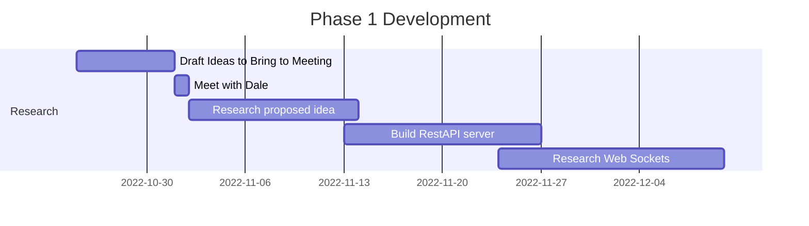
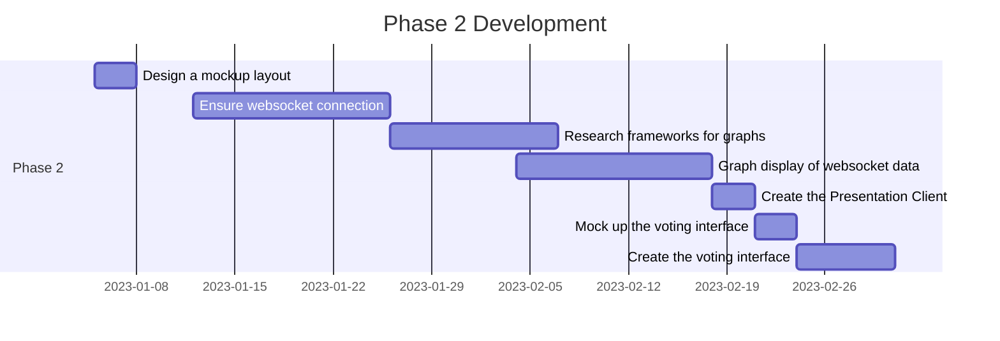
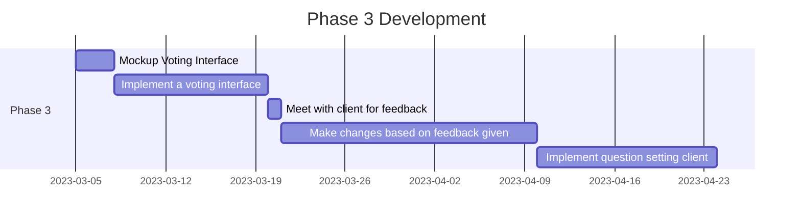

# Individual Project – Integrated Voting Within PowerPoint

## Abstract

This project is a proof of concept to show that it is possible to integrate a voting system within PowerPoint presentation. The aim is to increase student participation within the classroom, without disrupting the flow of the lesson. The solution is designed to be easily integrated within the teachers existing workflow, and be accessible for both the teacher and the students. The solution will be completed using a variety of technologies, including websockets, a REST API, and a web application.  

## Acknowledgements

I would like to thank my amazing project supervisor Allan Callaghan for all his help and support throughout the project. Thank you also to Sir Rodger Manwood's School for allowing me to work with them on this project.

## Table of Contents

- [Individual Project – Integrated Voting Within PowerPoint](#individual-project--integrated-voting-within-powerpoint)
  - [Abstract](#abstract)
  - [Acknowledgements](#acknowledgements)
  - [Table of Contents](#table-of-contents)
  - [Introduction](#introduction)
  - [Problem Analysis](#problem-analysis)
    - [Aims](#aims)
    - [Scope of the project](#scope-of-the-project)
    - [Objectives](#objectives)
    - [Outside of the scope of the project](#outside-of-the-scope-of-the-project)
    - [Literature review](#literature-review)
      - [Talk less Teaching](#talk-less-teaching)
      - [Technology and the Modern Classroom](#technology-and-the-modern-classroom)
    - [Existing Similar Solutions](#existing-similar-solutions)
      - [Mentimeter](#mentimeter)
      - [Poll Everywhere](#poll-everywhere)
      - [Kahoot](#kahoot)
    - [Users](#users)
  - [Software Design Analysis](#software-design-analysis)
    - [User Stories](#user-stories)
    - [Development Methodology](#development-methodology)
    - [Technology Selection](#technology-selection)
  - [Phase 1 Development](#phase-1-development)
    - [Goals For Phase 1](#goals-for-phase-1)
    - [Challenges](#challenges)
      - [Client Meeting](#client-meeting)
      - [Importing webpages into PowerPoint](#importing-webpages-into-powerpoint)
      - [Web Viewer Limitations](#web-viewer-limitations)
    - [Successes](#successes)
      - [Proposed Ideas for Client Meeting](#proposed-ideas-for-client-meeting)
      - [Client solution Discussion](#client-solution-discussion)
      - [Web Viewer add in for PowerPoint](#web-viewer-add-in-for-powerpoint)
      - [Viewing a webpage in Web Viewer](#viewing-a-webpage-in-web-viewer)
      - [RestAPI Server](#restapi-server)
      - [Containerizing the RestAPI Server](#containerizing-the-restapi-server)
      - [Long Term Learnings](#long-term-learnings)
  - [Phase 2 Development](#phase-2-development)
    - [Goals for phase 2](#goals-for-phase-2)
    - [Challenges](#challenges-1)
      - [Websockets](#websockets)
      - [Chart.JS Library](#chartjs-library)
    - [Successes](#successes-1)
      - [Receiving Websockets](#receiving-websockets)
    - [Milestone Retrospective](#milestone-retrospective)
      - [Short Term Learnings](#short-term-learnings)
      - [Design](#design)
      - [Chart.JS v2](#chartjs-v2)
      - [Websockets to votes](#websockets-to-votes)
    - [Phase 2 Evaluation](#phase-2-evaluation)
      - [Short Term Learnings](#short-term-learnings-1)
      - [Long Term Learnings](#long-term-learnings-1)
  - [Phase 3 Development](#phase-3-development)
    - [Goals for phase 2](#goals-for-phase-2-1)
    - [Challenges](#challenges-2)
      - [Contacting my client for feedback](#contacting-my-client-for-feedback)
    - [Successes](#successes-2)
      - [Designing the voting interface](#designing-the-voting-interface)
      - [Creating the voting interface page](#creating-the-voting-interface-page)
  - [Future Phase Of Development](#future-phase-of-development)
  - [Conclusion](#conclusion)
    - [Technical Evaluation](#technical-evaluation)
    - [Final Deliverable](#final-deliverable)
    - [Business case](#business-case)
    - [Future Work](#future-work)
    - [Evaluation](#evaluation)
  - [References](#references)
  - [Appendices](#appendices)
    - [Links to Repositories](#links-to-repositories)


## Introduction

This proof of concept project, working in collaboration with Sir Rodger Manwood's School, is designed to engage students with an age range of 12 - 18 more within the classroom. The aim is to design a seamlessly integrated participation tool that can easily fit into a teachers existing workflow to help students to focus more within the classroom. Having to navigate to a separate website or application to participate in a lesson can be disruptive and can slow down the flow of the lesson.

## Problem Analysis

This solution was conceptualized working with the head of ICT at Sir Rodger Manwood's secondary school. He wanted a way to increase interactivity within his lessons, without having to break the flow of the lesson, which could introduce disruption and slow down learning. A tool to be able to ask questions to his students and get live feedback from them, without having to switch windows or utilize external tools. This will be a prototype to prove the concept, not a full commercial solution, and I will be working incrementally with the teacher to get feedback and improve the solution.

### Aims

The aims of this project are:

1. Increase student participation within the classroom.
2. Avoid Disruption to the flow of the lesson.
3. Be easily integrated within the teachers existing workflow.
4. Be accessible for both the teacher and the students.
5. Be able to be used by teachers with minimal additional training.
6. Be able to be used by students with no additional training.
7. Keep students engaged within the classroom.
8. Get feedback from students of their understanding of the lesson.

### Scope of the project

It is important to define, what is and what is not required for this prototype. This will help to keep the project on track and avoid scope creep. The scope of this project is:

### Objectives

The solution must have:

- Be accessible within existing workflows, in this case PowerPoint.
- Live update the results of the poll when a vote is received.
- The votes should be shown in a graphical format.
- The vote should be easily accessible to students.
  
The solution should have:

- The ability to export vote data to excel. // The data is portable, accessible

The solution could have:

- 

The solution won't have:

- A login system
- Any form of authentication

// Integration with existing workflow
// Classroom context, No logins needed
// What are you using
// Avoid Lengthy login processes

Reference educational theory about involving them

### Outside of the scope of the project

These are outside of the scope of this project but could be considered in the future.

- Integration with other presentation software
- User testing due to it not being used by a wider audience.
- User manual, as the user will be trained in the use of the software.
- No need to consider monetization, as this is a proof of concept project.

### Literature review

#### Talk less Teaching

The main concept behind 'Talk Less Teaching' is to increase the amount of time students are actively engaged in the lesson. This is done by reducing the amount of time the teacher is talking (Wallace, 2014). This gives the students time to not only absorb the information that has just been presented to them, but also develop their own understanding of the material. By allowing students to take their own path through the material, they are able to make mistakes along the way and learn to deal with them, rather than just be told the correct path (McGrath, 2019). Students were found to be <i>"Significantly less attentive during teacher talk"</i> (Napoles, 2007). This shows that students are more engaged when they are actively participating in the lesson, rather than just being talked at. This is the main concept behind this project, to increase student participation within the classroom and allow the teacher to give students time to think.

#### Technology and the Modern Classroom

Technology is an essential tool for teaching and learning in the 21st century (Muir-Herzig, 2004) it has revolutionized education and has allowed for new ways of teaching and learning (Raja, 2018). Technology not only helps to convey the material in a more attractive manner to students but also increases levels of engagement within the lesson (Ratheeswari, 2018).

Why and how is technology being used in the classroom. What are the benefits of using technology in the classroom.

### Existing Similar Solutions

While some commercially available solutions do exist, none of them have the proposed feature-set that my solution aims to provide. Most of these solutions shown do not integrate into existing workflows, or when they do they are lacking convenience features like QR code to join.

#### Mentimeter

Mentimeter is a response tool that allows for the creation of interactive presentations. It allows for the creation of polls, quizzes, word clouds and more. It is a web-based application that has a free beginning tier, that has limitations on its usage but is available as a paid service (Iona,2018). It allows live responses to open and closed questions. Mentimeter allows the use of may different question types, including polling, word clouds, quizzes and surveys (Mentimeter.com, n.d.).

> Screenshots of the application:
> Mentimeter Presentation Display             |  Mentimeter Voting Display
> :-------------------------:|:-------------------------:
>  | 

Features of the product:

- Menti allows the creation of presentations that have audience participation with quizzes and polls.
- Is able to store logs of questions answered, time to answer and 
- It has the ability to create polls, quizzes, word clouds and more.
- Customizable themes and layouts.
- Allows the use of images as answers to questions.
- Supports QR code to join the presentation.

Limitations:

- It doesn't seamlessly integrate into existing workflows, you have to switch to a web browser.

Mentimeter can be found [here](https://www.mentimeter.com/)


Break down what it is these solutions are doing.

//You focused on these features, becuase.

//What is the problem how will it nbe used

#### Poll Everywhere

Like Mentimeter, Poll Everywhere is a web-based real-time audience response system. Unlike Mentimeter, Poll Everywhere integrates with google slides and Microsoft PowerPoint (Poll Everywhere, n.d.). It is able to create word clouds, polls, quizzes and more. It is a paid service, with a free tier that has limitations on its usage. Poll Everywhere allows for the collection and tracking to responses to questions and polls. Poll everywhere also has the unique feature of allowing users to text in their responses to questions, which is a feature unavailable on the other 2 solutions.

> Screenshots of the application:
> Poll Everywhere Presentation Display             | Poll Everywhere Voting Display
> :-------------------------:|:-------------------------:
>  | 
>
> ---
>
> <p align="center"><b>Poll Everywhere In PowerPoint</b></p>
>
> ---
> 
> 

Features of the product:

- Poll Everywhere integrates into PowerPoint
- Has the ability to text in, to answer questions. Useful for situations with no internet access.
- Has a simple and easy to use interface.

Limitations:

- Doesn't have easy joining with QR codes
- Requires administrator privileges to install separate executable application to work with PowerPoint, this can be found [here](https://www.polleverywhere.com/app/powerpoint/win)
- Has a very limited free tier in terms of the number of participants and questions that can be asked.
- Doesn't have a leaderboard feature.
- Quite Bland design.

#### Kahoot

Kahoot is a game-based learning solution (Wang, 2020) that allows users to create quizzes and games for students to play. It is a web-based application that has a free beginning tier, that has limitations on its usage but is available as a paid service with enhanced features such as team vs team modes (Kahoot, 2020).

> Screenshots of the application:
> Kahoot Joining Screen            |  Kahoot Mobile Display
> :-------------------------:|:-------------------------:
>  | 
> <b>Kahoot Joined Member Screen</b> | <b>Kahoot Answer Screen</b>
>  | 
>
> ---
>
> <p align="center"><b>Kahoot Question Screen</b></p>
>
> ---
>
> 

Features of the product:

- Kahoot allows the creation of quizzes and games.
- Has a leaderboard for students to see their progress.
- It allows for the use of images in questions.
- Has the ability to join the game with a QR code.
- Allows for the use of a nickname to join the game.
- Able to export the results of the game to a spreadsheet.

Limitations:

- It doesn't seamlessly integrate into existing workflows, you have to switch to a web browser.
- The question is not shown on the device of the user, they have to look up at the screen to see the question.
- Doesn't seem very suited to a more mature audience. This has all the features that would make it ideal for a younger audience, bright colors, playful music, and a game-like interface.

### Users

- Student

  - The student is the user that will be interacting with the voting application the most. They will be using the application to answer questions and participate in the lesson.
  - This user is highly unlikely to use the application to create questions.

- Classroom Teacher
  
  - The classroom teacher is the user that will be using the application within the lesson. They will see the students voting on the question and will be able to discuss results.
  - This user my also want to use the application to create the questions for the lesson.

- Head Of Department (HOD)

  - The head of department is the user that will be using the application to create the questions for the lesson. They will be able to create the questions and add them to the presentation.

- Senior Leadership Team (SLT)

  - The senior leadership team is the user that will be using the application to view data from the lesson. They will be able to see the results of the questions and the answers that the students have given, to ensure the students are learning.

## Software Design Analysis

### User Stories

1. As a Student I want to be able to see the question that I am voting on, on my device in synchronization with the lesson so that I do not have to look up at the screen or select the question allowing me to focus on the question at hand.

     - This user story will be achieved when the question is displayed on the device of the user, and the question is synchronized with the presentation.

2. As a Head of Department, I would like to be able to add the vote to my presentations 3 days before the vote starts, so that they are ready to be used within the lesson when the slides are given to the classroom teacher and can be added during my planning time as this fits into my existing workflow.

     - This user story will be achieved when the poll slide is able to be saved and recalled in PowerPoint, with no user intervention required.

3. As a Classroom Teacher I would like for the voting application to have a Large title and results shown so that it is easily discernable from the back of the classroom.

     - This user story will be achieved when the poll slide is able to be clearly seen from the back of the classroom.

4. As a Classroom Teacher I would like to be able to see the results of the currently presented vote in real time, so that the students can see their votes having an impact on the final tally and be able to discuss their decisions with the class.

     - This user story will be achieved when the poll responds to the votes of the students in real time, and the results are displayed on the presentation.

5. As a Student I would like a qr code to be shown on the polling slide to take me to the website, so that it is easily and conveniently accessible from my mobile device without having to type in a long URL.

     - This user story will be achieved when the poll presentation screen is able to generate a QR code that links to the voting client.

6. As a Student with visual impairments, I would like for the voting application and the presentation application to use accessible fonts so that I can easily see the question, the options and have the ability to participate like my peers.

     - This user story will be achieved when the poll presentation screen is able to generate a QR code that links to the voting client.

7. As a Senior Leadership Team member, I would like to be able to see the results of the vote after the lesson has finished, so that I can see how the students have performed and if they have understood the lesson.

     - This user story will be achieved when the poll is able to store the results of the vote and display them to the user after the lesson has finished. This could via a web interface or an Excel spreadsheet.

### Development Methodology

This project will be utilizing the agile methodology. This methodology utilizes a series of "sprints" to develop the solution. The most important factor in the agile methodology is client satisfaction (McCormick, 2012). This project will have 3 main phases, these are:

- Phase 1: September to January
- Phase 2 January to March
- Phase 3 March to May

Each of these phases will have a series of sprints, these sprints will be 2 weeks long. Each sprint will have a series of tasks that will be completed within the sprint. By using this methodology, it will allow for client feedback to help guide this project incrementally.

### Technology Selection

The software stack that will be used for this project is:

- FastAPI for the RestAPI server. This will handle incoming requests from the voting client and sending out data to the presentation client.
- Websockets for the communication between the voting client and the presentation client. This will allow for real time updates to the presentation client.
- Docker will be to containerize the application. This will allow for the application to be easily deployed to a server.
- chart.js will be used to display the results of the vote to the user in a graph-based representation.
- vue.js will be used on the voting client to communicate with the RestAPI server.

## Phase 1 Development



### Goals For Phase 1

- List a series of ideas to bring to the client meeting that could potentially aid in teaching.
- Meet with the client to discuss the project and determine the requirements.
- Research the proposed solution and determine if it is feasible.
- Create the API server for the voting system.
- Research web sockets and their implementation.
- Test websocket functionality within Web Viewer.

### Challenges

#### Client Meeting

Unfortunately I was unable to meet with the client until much later than expected (7/12/22) which set back my entire project from the start as I was unable to determine the requirements of the project. The only things I could really do for the project was to research some potential solutions to bring to the client as proposals. This meant that the project was really only able to start halfway through the first phase.

#### Importing webpages into PowerPoint

 In older versions of PowerPoint using embedded objects was supported but has since been discontinued and made obsolete. There were many plugins online promising to add live webpage functionality to Powerpoint but these were all antiquated, and only supported old versions of PowerPoint. Due to the nature of the environment that this solution was to be used in, it was not appropriate to install third party software that was not supported by the school.

#### Web Viewer Limitations

Reading the reviews for the webview add in for PowerPoint, reviews were overwhelmingly negative, with many users reporting that the add in did not work at all. “Doesn’t work with basic sites”, “Waste of time” and “Next to useless” (Microsoft Corporation, 2023) were just a few of the reviews that contributed to the 1.9 star rating on the Microsoft store. When imported into a presentation, most webpages would not load and would display a blank screen. Trialing several webpages, the only webpage that did work with the add in was wikipedia.org.

### Successes

#### Proposed Ideas for Client Meeting

Before the client meeting, I was able to come up with a series of ideas that could potentially aid in teaching. These ideas were:

- An audio based individualized feedback tool. This would allow the client to record audio feedback for each student individually and have it transcribed into text. This would allow for the client to give more detailed feedback to each student without having to spend hours writing it out.
- A filler word counter and talking time tracker. This would allow the client to see how many times they use filler words such as “um” and “ah” and how long they spend talking. This would use some form of voice recognition to determine when the client is talking and count the time. The client could then use this information to improve their teaching and make their lessons more concise.

When proposed to the client, they were both rejected as they either did not fit the use case or the client already had a solution in place.

#### Client solution Discussion

After meeting with the client, we were able to determine a tool that would compliment his teaching. The proposed solution was to implement a voting system that would work within PowerPoint and would display feedback from students live within the PowerPoint presentation. The method of voting was as of yet undecided between a hardware-based device or a web-based client, but eventually settled on a web-based client due to the complexity and cost of a hardware-based solution. This means students would be able to use their phones or computers to interact with the voting system.

#### Web Viewer add in for PowerPoint

The Web Viewer add in for PowerPoint was the perfect solution for this use case. It is easy to install, easy to use and worked with the latest version of PowerPoint. It was also an official Microsoft add in, so it was from a trusted and secure source that is already used within the school. It is also free to use, which means the school incurs no extra costs. The add-in allowed for the embedding of live webpages within PowerPoint, and the ability to navigate to different webpages within the same slide.

#### Viewing a webpage in Web Viewer

After Wikipedia.org loaded successfully in the Web Viewer add in, the task was to figure out what made that page different to the others that were tested. Loading a basic "Hello World" HTTP page worked also. Web Viewer seemed to have issues displaying some forms of Javascript content. Testing other basic webpages worked also. Simple Javascript pages, such as canvas, worked also.

#### RestAPI Server

The first step in creating the RestAPI was importing the required frameworks and libraries. FastAPI was used to create the RestAPI server. Pydantic was used to create the models for the data that would be sent to the server. By using Pydantic data models data received can be validated and error checked automatically, a feature of the FastAPI framework. 

```python
# Importing Libraries -----------------------------
from fastapi import FastAPI, WebSocket
from fastapi.responses import HTMLResponse
from pydantic import BaseModel
from collections import defaultdict
from asyncio import Queue

app = FastAPI() # Create a FastAPI instance

#Pydantic Class Model ---------------------------
class Question(BaseModel):
    qTitle: str
    qAnswers: list[str]
    
class Vote(BaseModel):
    qResponse: int
```

CORS middleware was added to the server to allow for cross origin requests. This is required as the voting client will be hosted on a different server to the RestAPI server. CORS middleware was added to the server by using the following code.

```python
#----------------------------------------------------
app.add_middleware(
CORSMiddleware,
allow_origins=["*"], # Allows all origins
allow_credentials=True,
allow_methods=["*"], # Allows all methods
allow_headers=["*"], # Allows all headers
)
#----------------------------------------------------
```

A default route was created to handle any requests that go to the root of the url. This route returns a simple HTML page that displays a message to the user informing them this is an incorrect url.

```python
# Default Route ---------------------------------
@app.get("/",response_class=HTMLResponse,status_code=200)
async def Default():
    return """
    <html>
        <head>
            <title>I'm Sorry I think You're Lost....</title>
        </head>
        <body>
            <h1>I'm Sorry I think You're Lost....</h1>
            <h2>This is not the page you are looking for</h2>
        </body>
    </html>
    """
```

 This endpoint accepts a JSON object that is validated against the Question model. If the JSON object is valid, it is added to the questions dictionary. The key for the question is the length of the dictionary, which is incremented by one each time a question is added. This allows for the questions to be stored in a sequential order.

```python
questions = {}

# Post Question Route ----------------------------------------
@app.post("/question")
async def make_question(question: Question):
    print("start")

    questionTitle = question.dict() # Convert the question to a dictionary and store it in a variable
    
    max_value = max(questions, key=questions.get, default=0)
    max_value = max_value + 1
    questions[max_value] = dict(questionTitle) # Add the question to the questions dictionary

    print(questions)
    
    return "Success",questions
```

An example of accepted JSON can be seen below.

```json
{
    "qTitle": "What is your favorite color?",
    "qAnswers": [
        "Red",
        "Blue",
        "Green",
        "Yellow"
    ]
}
```

The next step was to create an endpoint to accept votes. This endpoint accepts a JSON object that is validated against the Vote model. If the JSON object is valid, it is added to the responses dictionary. The key for the response is the value of the qResponse key in the JSON object. This allows for the responses to be stored in a sequential order.

```python
responses = defaultdict(int) # Create a dictionary to store the responses

# Vote Acceptance Route ----------------------------------------
@app.post("/response")
async def accept_vote(vote: Vote):
    
    responses[vote.qResponse] += 1

    await q.put(responses)
    print(responses)
    return "Success"
```

Votes are accepted in the following JSON format.

```json
{
    "qResponse": 1
}
```

In this case, this would be a vote for the answer in position 1 of the qAnswers list. I did it this way to allow for an unlimited amount of answers to be offered.

The final step was to create an endpoint to return the questions. This endpoint returns the questions dictionary in JSON format.

```python
# Get Question Route ----------------------------------------
@app.get("/question/")
async def return_question():
    print(questions)
    return questions
```
an example of the JSON response from this endpoint can be seen below.

```json
{
    "1": {
        "qTitle": "What is your favorite color?",
        "qAnswers": [
            "Red",
            "Blue",
            "Green",
            "Yellow"
        ]
    },
}
```

The websocket implementation was more complicated due to my inexperience with websockets. This required research into how websockets work and how to implement them in Python. The code for the websocket can be seen below.

```python
q = Queue() # Create a queue for the websocket connections

# Websocket Route ----------------------------------------
@app.websocket("/ws")
async def websocket_endpoint(websocket: WebSocket):
    await websocket.accept()
    try:
        while True: #ques put and get
            data = await q.get() # Get the data from the queue
            await websocket.send_json(data) # Send the data to the client
            print("websocket", data)
    except:
        pass
```

The websocket endpoint awaits a websocket connection request on the `/ws` endpoint and accepts one when it is received. The loop is used to continually receive data from the queue and send it to the client. The data is then retrieved from the queue and sent to the client in JSON format. An example of the JSON data sent to the presentation client can be seen below.

```json
{
    "1": 1,
    "2": 3,
    "3": 5,
    "4": 0
}
```

This means that the question in the 1 position has 1 vote, the question in the 2 position has 3 votes, the question in the 3 position has 5 votes and the question in the 4 position has 0 votes.

#### Containerizing the RestAPI Server

In order to make the server easily deployable, the server was containerized using docker. The Dockerfile used to containerize the server can be seen below.

```dockerfile
FROM python:slim
RUN pip install fastapi uvicorn
WORKDIR /app/
COPY . .
CMD ["uvicorn", "server:app", "--host", "0.0.0.0"]
```

A make file was then made to make the process of building and running the container easier. The make file can be seen below.

```makefile
DOCKER_IMAGE:=server
help:
	@echo "make <target>"
	@echo "  help       Show this help"
	@echo "  build      Build the server docker image"
	@echo "  run 		Run the built image"
build:
	docker build --tag ${DOCKER_IMAGE} .

run:
	docker run --rm -it --publish 80:8000 ${DOCKER_IMAGE}
```

The make file can be ran by using the command `make build` to build the container and `make run` to run the container. The container can be accessed on port 80.


#### Long Term Learnings

// link back to aims and objectives, double check markscheme

Reflecting on what I have learned in this phase, a key point for me would be to not underestimate task sizes. Not only this, but I have also learned that what might not work for other people, doesn't mean it won't work for your use case, just set your expectations right. I have also learned that I need to be more proactive in asking for help when I am stuck, as I spent a lot of time trying to figure out why the Websocket connection was not being established, as it would have saved time if I had asked for help earlier.

## Phase 2 Development



### Goals for phase 2

- Get the Websocket connection working within Web Viewer
- Research into the best way to display the data within PowerPoint
- Design a mockup of the presentation interface
- Get a graph to display the data within PowerPoint
- Implement the presentation client
- Mock up the voting interface
- Create the voting interface

### Challenges

#### Websockets

Websocket support was critical to enable the live updating feature on the presentation client. Creating a simple webpage that shows the data received through a websocket connection. After loading the page in Web Viewer, the websocket connection was not established. When tested within a browser the page worked fine. This was a limitation of the Web Viewer add in for PowerPoint.

The below code was used to test the websocket connection.

```html
<!DOCTYPE html>
 
<html lang="en">
 
<head>
 
    <meta charset="UTF-8">
 
    <meta http-equiv="X-UA-Compatible" content="IE=edge">
 
    <meta name="viewport" content="width=device-width, initial-scale=1.0">
 
    <title>WebSocker Client</title>
 </head>
<body>
    <button onclick="contactServer">Click Here</button>
</body>
<script>
    const socket = new WebSocket('ws://88.111.67.58/ws');
 
    socket.addEventListener('open', function (event) {
 
    socket.send('hello');
});
 
socket.addEventListener('message', function (event) {
 
    document.write(event.data);
 
});
 
const contactServer = () => {
 
    socket.send("Hello");
    document.write(event.data);
 
}
 
</script>
 
</html>
```

When the button displayed on the HTML page is clicked the `contactServer` function is called. This function sends a message to the websocket server and then displays the response on the page. This allows for the testing of the websocket connection without access to the console.

#### Chart.JS Library

Chart.Js seemed like the most appropriate library to use for showing the votes in a bar graph style, due to its ability to update live. The Chart.js Library can be found [here](https://www.chartjs.org/), and an example of its capabilities can be seen below.

> 
> 
> <p align="center"><i>Chart.Js Example Bar Graph (Chart.Js, 2023)</i></p> 

This entire graph is generated using code and the Chart.js library.

To ensure its functionality within Web Viewer, the default template was added to a HTTPS page and loaded. The default template can be seen below.

```HTML
<!DOCTYPE html>
<html>
<head>
  <title>Test</title>
  <script src="https://cdn.jsdelivr.net/npm/chart.js"></script>
</head>

<body>
  
<div>
  <canvas id="myChart"></canvas>
</div>

<script>
  const ctx = document.getElementById('myChart');

  new Chart(ctx, {
    type: 'bar',
    data: {
      labels: ['Red', 'Blue', 'Yellow', 'Green', 'Purple', 'Orange'],
      datasets: [{
        label: '# of Votes',
        data: [12, 19, 3, 5, 2, 3],
        borderWidth: 1
      }]
    },
    options: {
      scales: {
        y: {
          beginAtZero: true
        }
      }
    }
  });
</script>

  
</body>
</html>
```

<p align="center"><i>Chart.Js Getting Started Bar Graph Code (Chart.Js, 2023)</i></p>

This can be found [here](https://github.com/Joshua-Yuill/Votley_Final-Year-Project/blob/327db0f6b5a3b515291bd263bff99328f3cb7ef6/Testing/Chart.html#L1)

A comparison of the default template in a browser and in Web Viewer can be seen below.

>Chart.Js Example Code In Browser            |  Chart.Js Example Code In Web Viewer
> :-------------------------:|:-------------------------:
>  | 

Nothing but a blank screen again. Testing it in a browser and it was displaying; This was another Web Viewer limitation.

Researching into Web Viewer, it was found that it uses an old version of Microsoft Edge, version 1.9.0.0, an old and no longer supported browser. Because of this it did not contain all the latest features in modern browsers such as Web Workers which was utilised within the Chart.js library.

After much anguish and frustration, trying to look for a new library that would be compatible with this antiquated browser, one of my peers suggested using an older version of the Chart.js library.

Show Screenshots, Show experiments, show test data show the design

### Successes

#### Receiving Websockets

Development log. You actually built something. Next phase, next date. these things were not identifed so had to cover this thing. have dates and milestones. Have it as developemnt log. by date

Resuming research into Websockets, I found there are two types of Websockets, secure and insecure. Secure Websockets use the `wss://` protocol and insecure Websockets use the `ws://` protocol. The Web Viewer add in for PowerPoint only supports secure Websockets, this is due to the fact that Web Viewer only supports the HTTPS protocol. This was the reason why the Websocket connection was not being established. The adapted code for the Websocket connection can be seen below.

RestAPI Server Side:

```python
# Websocket Route ----------------------------------------
@app.websocket("/wss")
async def websocket_endpoint(websocket: WebSocket):
    await websocket.accept()
    try:
        while True: #ques put and get
            data = await q.get() # Get the data from the queue
            await websocket.send_json(data) # Send the data to the client
            print("websocket", data)
    except:
        pass
```

Websocket Test WSS:

```javascript
const socket = new WebSocket('wss://connection.kimochi.uk/wss');
 
    socket.addEventListener('open', function (event) {
 
    socket.send('hello');
 
});
```

In order to get a HTTPS certificate for the server, a domain name was purchased. This domain was then proxied to the server using cloudflare. An A record was created for the subdomain "connection". The record created in cloudflare can be seen below.

> 
>
> <p align="center"><i>A record created in cloudflare</i></p>

Any requests to the subdomain "connection" would seem to be from a HTTPS source, allowing us to use the `wss://` protocol.

Testing this within Web Viewer, the JSON data was displayed on the page, signifying that the connection was successful.

> 
>
> <p align="center"><i>Websocket Data Recived within Web Viewer</i></p>

### Milestone Retrospective

// Did we fufill the goals, yes no, patial. We can record votes using a an api. its viewable live

#### Short Term Learnings

// compare goals in the begining of the phase and to what was actually achieved.

// Re evaluate this

Looking back at the progress made in Phase 1, it was not as substantial as I first thought it was going to be. My inexperience in accurately sizing tasks to be completed led me to be over ambitious with the amount of work I could complete in the time frame. I have learned that I need to more accurately size tasks that I have not done before, and give them a little more time, even if on the surface they seem quite easy. I was able to complete the research into the proposed idea and the research into the technology that would be used. I was also able to complete the development of the RestAPI server that would be used to send the data to the PowerPoint client.

#### Design
To start  a design was mocked up that would hopefully represent what the final implementation will look similar too. This was mocked up inside a PowerPoint window to be able to really judge how the final design would look. This mockup can be seen below.

>
>
><p align="center"><i>Figure 1: PowerPoint client design mockup</i></p>


In this design I have made some assumptions based on the target audience, including:

- The question is boldest and located at the centre of the design, where yours eyes are drawn to first. This keeps the focus on the question and not the results.
- There are clear instructions at the top of the design, instructing the users on how they can participate in the vote. The instructions are clear and simple as to not cause any ambiguity.
- The use of the auto-generated QR code allows for easy access to the voting page, without having to type in a long URL. This is a huge advantage not only for the students in terms of ease of access but also for the teacher as it reduces the amount of time spent on trying to navigate to the voting page.
- The design dedicates half of the page to a graph displaying the outcome of the vote, this makes it not only easy for the students and teacher to see the progress of the vote, but for the teacher to discuss the outcome of the vote with the class in greater depth if necessary.
- All fonts are a fork of the sans-serif font Helvetica ensuring that students with low vision can still read the text clearly (Buultjens, 1999). This satisfies user requirement 6.
- The colors of the graph are distinct and bold so that they can easily be distinguished from one another.

#### Chart.JS v2

Working backwards from the latest version of Chart.js (Version 4) every version of Chart.Js was tried to check for functionality within Web Viewer. Version 2 managed to successfully display within Web Viewer, albeit without color, this however was an easy fix by just defining the color pallet

#### Websockets to votes

Now that charts were displaying within Web Viewer, I had to be able to take in the votes from the websocket connection. This was new for me understanding how to take in data from a websocket connection, but after a little research I was able to get the graph moving to the incoming votes.

Once I had the ability to manipulate the graph with votes it was time for the finishing touches on the powerpoint client. This included using an API that takes in a url and returns a QR code image. and the title being to the right and the voting to the left. This was all done using HTML and CSS. After it was all done I am pretty impressed with the final result especially with how close it resembles the mockup. This can be seen below.

>
>
><p align="center"><i>PowerPoint client Final Implementation</i></p>

The code for this client can be seen below.

```html
<!DOCTYPE html>
 
<html lang="en">
<script type="text/javascript" src="https://gc.kis.v2.scr.kaspersky-labs.com/FD126C42-EBFA-4E12-B309-BB3FDD723AC1/main.js?attr=x2zB1vmT3MJv9YDouxU76A-tYr-s6ldjIKXGtCjbVO__uzJS-tFU6sntL5zwqei6PbxGwM8kDOgjjdf5ZHyOC-MdOm2NWzRx87y2Tyngmw3-nzABOpktcvO_OtwLiLJn6yHhzwUm4ZSS8zyWzBdLoqtULJaC-FCj0ycvpkP6Zrywtmxt1JM2STFtRHmQwLkw44dnlYI6Dm2L2OMQ6EjwlQ" charset="UTF-8"></script><link rel="stylesheet" crossorigin="anonymous" href="https://gc.kis.v2.scr.kaspersky-labs.com/E3E8934C-235A-4B0E-825A-35A08381A191/abn/main.css?attr=aHR0cHM6Ly93aHNlcnZlci5jYW50ZXJidXJ5LmFjLnVrOjIwODMvY3BzZXNzNTIyMTU3NjUxNi9kb3dubG9hZD9za2lwZW5jb2RlPTEmZmlsZT0lMmZob21lJTJmbWlmZXJxZSUyZnB1YmxpY19odG1sJTJmaW5kZXguaHRtbA"/><script src="/chart.js@v2"></script>

<style>
body
{
    font-family: 'Helvetica', 'Arial', sans-serif;
    color: #444444;
    font-size: 40pt;
    background-color: #FAFAFA;
    text-align: center;
}
.column {
  float: left;
  width: 50%;
}

.row:after {
  content: "";
  display: table;
  clear: both;
}

.now{
    font-family: 'Helvetica', 'Arial', sans-serif;
    color: #01A982;
    font-size: 20pt;
    background-color: #FAFAFA;
    text-align: center;
}
</style>
    <meta charset="UTF-8">
 
    <meta http-equiv="X-UA-Compatible" content="IE=edge">
 
    <meta name="viewport" content="width=device-width, initial-scale=1.0">
 
    <title>Powerpoint Websocket Client</title>
 
</head>
 
<body>
<div class="row">
<div class="column">
    <p><b>Did William the Conqueror Win the Battle of hastings in 1066?</b></p>
    <br>
    
    <div class="now">Cast your vote now!</div>
</div>
<div class="column">
    <canvas id="myChart"width="5" height="5"></canvas>
</div>
</div>
</body>
 
<script>
  const ctx = document.getElementById('myChart');


  const data = {
    labels: ['He Won The war','He died in battle','He lost the war'],
    datasets: [{
      label: 'No Of Votes',
      data: [0,0,0],
      backgroundColor: [
        'rgba(255, 26, 104, 0.2)',
        'rgba(54, 162, 235, 0.2)',
        'rgba(255, 206, 86, 0.2)',
        'rgba(75, 192, 192, 0.2)',
        'rgba(153, 102, 255, 0.2)',
        'rgba(255, 159, 64, 0.2)',
        'rgba(0, 0, 0, 0.2)'
      ],
      borderColor: [
        'rgba(255, 26, 104, 1)',
        'rgba(54, 162, 235, 1)',
        'rgba(255, 206, 86, 1)',
        'rgba(75, 192, 192, 1)',
        'rgba(153, 102, 255, 1)',
        'rgba(255, 159, 64, 1)',
        'rgba(0, 0, 0, 1)'
      ],
      borderWidth: 1
    }]
  };


  const config = {
    type: 'bar',
    data,
    options: {
        scales: {
            yAxes: [{
                ticks: {
                    beginAtZero: true
                }
            }]
        }
    }
  };

  // render init block
  const myChart = new Chart(
    document.getElementById('myChart'),
    config
  );

  function addData(chart, label, data) {
    chart.data.labels.push(label);
    chart.data.datasets.forEach((dataset) => {
        dataset.data.push(data);
    });
    Chart.update();
}
 


  const socket = new WebSocket('wss://connection.kimochi.uk/wss');
 
    socket.addEventListener('open', function (event) {
 
    socket.send('hello');
 
  });
 
 
 
  socket.addEventListener('message', function (event) {
 
    //document.write(event.data);
    
    var obj = event.data;
    
    console.log(typeof event.data);
    
    let start = "'";
    var val = parseInt(obj[5])
    
    var datas = JSON.parse(event.data);
    console.log(datas);
    console.log(datas[0]);

    myChart.data.datasets[0].data[0] = datas[0];
    myChart.data.datasets[0].data[1] = datas[1];
    myChart.data.datasets[0].data[2] = datas[2];
    myChart.update();
    
 
  });
 
  const contactServer = () => {
 
    socket.send("Hello");
 
  }
 
</script>
<!--Chart.js for visulaisations in powerpoint-->
 
</html>
```

### Phase 2 Evaluation

#### Short Term Learnings

After another setback due to the limitations of Web Viewer, I was able to get a working interface that would react to incoming data. This however took far longer than I originally anticipated, which again had a knock on affect of the progress of the project. This combined with trying to fix issues that were not addressed within the previous phase put me behind schedule.

#### Long Term Learnings

This again highlights my inexperience when it comes to weighting tasks as I thought that it would take far less time than it actually did. This further set me back than I had anticipated, and I was not able to complete as much as I would have liked to in this phase.

## Phase 3 Development



### Goals for phase 2

- Mockup a design for the voting interface.
- Create a voting interface to interact with the Rest API.
- Get a meeting with my client to discuss the design and get feedback.
- Make feedback changes to the design.
- Implement a question setting client.

### Challenges

#### Contacting my client for feedback

An unexpected challenge that I faced within this project was being unable to get ahold of my client. Several meetings were booked with them and they were unable to attend. This was a huge setback as I was unable to get feedback on the design of the voting interface. Not only this, but time wasted chasing up emails and trying to get another meeting booked took away from the time I had to work on the project.

### Successes

#### Designing the voting interface

In order to design the voting interface, assumptions had to be made for the target audience. To ensure the solution remains accessible and the design language the same, the font used within the PowerPoint client was used within the voting interface.
In order to ensure consistency between the PowerPoint client and the voting interface, the same color pallet was used. This makes it easy to identify what answer corresponds to what color.
The design is simple and displays the question being asked at the top of the screen, with the options to chose from bellow. This makes it easy for the user to understand what they are voting for and what options they have to chose from.
>Voting Options Screen           |  Vote Selected Screen
> :-------------------------:|:-------------------------:
>  | 

When an option is selected the user is presented with a screen that confirms their vote. This allows the user to see what option they picked and can corroborate the color with the graph displayed in the presentation.

#### Creating the voting interface page

In order to easily submit votes to the server during demonstration to the client, a voting interface page was created. This page would allow the user to submit votes to the server just by pushing a button on a HTML page. This interface can be seen below.

The code for this interface can be seen below.

```html
<!DOCTYPE html>
<script src="https://unpkg.com/vue@3/dist/vue.global.js"></script>
<head>

<title>Voting Client</title>

</head>
<body>
<div id="app">
<p><b>Did William the Conqueror Win the Battle of hastings in 1066?</b></p>  
<button data-action="vote1" @click="vote1()">He won the war</button>
<button data-action="vote2" @click="vote2()">He lost the war</button>
<button data-action="vote3" @click="vote3()">He died on the battlefield</button>
{{ message }}
</div>

</body>
<script>
    const { createApp } = Vue  

    const RootComponent = {

        methods: {
            vote1(){ // Post item
                fetch(`http://88.111.67.58/response`, {
                    method: 'POST',
                    headers: {'Content-Type': 'application/json'},
                    body: '{"qResponse": 0}',
            })},

            vote2(){ // Post item
                fetch(`http://88.111.67.58/response`, {
                    method: 'POST',
                    headers: {'Content-Type': 'application/json'},
                    body: '{"qResponse": 1}',
            })},

            vote3(){ // Post item
                fetch(`http://88.111.67.58/response`, {
                    method: 'POST',
                    headers: {'Content-Type': 'application/json'},
                    body: '{"qResponse": 2}',
            })}
        }
    }

    const app = Vue.createApp(RootComponent)
	const vm = app.mount('#app')

</script>
```

This is what that page looked like. While it is incredibly basic in nature, its purpouse was to demonstrate the functionality of the voting interface to the client.

>

## Future Phase Of Development

If I was to have another phase of development I would be mainly focused on user feedback and improvements that can be made. This would include:

- Trialing the software in a classroom environment of older students (Sixth Form), and getting feedback from them.
- Getting the clients feedback on the product and does it work for them? If not what could be tweaked to make it work for them?
- Getting the question setting client working, so that the teacher can set their own questions.

## Conclusion

### Technical Evaluation

### Final Deliverable

I present to you, Votley. The integrated voting system for powerpoint.

>

A video of the live updating within powerpoint can be seen [here](https://youtu.be/v-abFtQlbxM)

// include screenshots of the final product and video of it working

### Business case

From a business perspective an application like this would be useful to teachers, due to its ease of implementation into their existing workflows. This application would need a lot of further development before it could be used in a real world setting, but the core functionality is there. Monetization could then be implemented as such to incur revenue for the company and continue future development.

### Future Work

Features I would have liked to implement with more time.

- web cookie based system, that would limit the voter to 1 vote per question.
- Teacher client, that would allow the teacher to set the questions before the class.
- Exporting of the data to a CSV file.
- A more robust system for handling errors.
- The ability to add multiple questions to a presentation.
- A clear button to clear all votes from the server.


### Evaluation

I think even though this project didn't reach all of its goals, I still believe it was a huge success in terms of my own personal development. This project challenged me in ways I thought were not possible. Throughout this project I have learnt many new skills, including helping me to better understand sizing tasks and dealing with having a client. I have learned not to underestimate tasks that at first glance seem simple, as they can often be more complex. I have also learned to better manage my time, as I feel I could have done a lot more if I had better time management and a rigid schedule. But ultimately this project taught me resilience as after every set back, and every downfall I got back up and I kept trying till I figured it out.

In terms of the project hitting its objectives, in this regard it failed. While the project hit a some aims and objectives, including the integration into existing workflows, I feel like it did not cover them all. I feel my lack of understanding of technologies such as the Web Viewer Add-In and websockets contributed greatly to a huge amount of delay in the project, due to me having to not only learn how they operate, but debug all of the unknown errors that came with them. Not only this but issues communicating with the client also caused delays within the project. In terms of a proof of concept though, I feel it successfully shows that the idea has merit and could be developed further in the future.

If I were to repeat this project I would have a much more rigid schedule, and give more dedicated time to tasks that I have not had any experience with before. I feel like client communication could be improved also as in this case I was unable to get any client feedback for my solution which I felt really hindered my progress. So in the future I would try to get more client feedback more regularly, for example at the end of every sprint. This could be formal or informal feedback.

## References

- Buultjens, M., Aitken, S., Ravenscroft, J. and Carey, K., 1999. Size counts: The significance of size, font and style of print for readers with low vision sitting examinations. British Journal of Visual Impairment, 17(1), pp.5-10.
- Chart.Js, 2023. Step-By-Step guide. [Online] Available at: https://www.chartjs.org/docs/latest/getting-started/usage.html [Accessed 18 05 2023].
- Consumer Insights, 2015. Attention spans, s.l.: Microsoft Canada, Spring.
- Iona, J., 2018. Mentimeter. School Librarian, 66(3), pp.153-154.
- Kahoot, 2020. What is Kahoot. [Online] Available at: https://kahoot.com/what-is-kahoot/ [Accessed 17 05 2023].
- McCormick, M., 2012. Waterfall vs. Agile methodology. MPCS, N/A, 3.
- McGrath, S., 2019. Talk Less So Students Learn More. Edutopia. Recuperado em, 16.
- Mentimeter.com, n.d. Audience Engagement Platform. [Online] Available at: https://www.mentimeter.com/features [Accessed 18 May 23].
- Microsoft Corporation, 2023. Web Viewer. [Online] Available at: <https://appsource.microsoft.com/en-us/product/office/WA104295828?tab=Reviews&exp=ubp8#> (Accessed on 2023-04-25)
- Muir-Herzig, R. G., 2004. Technology and its impact in the classroom. Computers \& Education, 42(2), pp. 111--131.
- Napoles, J., 2007. The effect of duration of teacher talk on the attitude, attentiveness, and performance achievement of high school choral students. Research Perspectives in Music Education, 11(1), pp.22-29.
- Raja, R. and Nagasubramani, P.C., 2018. Impact of modern technology in education. Journal of Applied and Advanced Research, 3(1), pp.33-35.
- Ratheeswari, K., 2018. Information communication technology in education. Journal of Applied and Advanced research, 3(1), pp.45-47.
- Wallace, I., 2014. Talk-less teaching: practice, participation and progress. Crown House Publishing.
- Wang, A.I. and Tahir, R., 2020. The effect of using Kahoot! for learning–A literature review. Computers & Education, 149, p.103818. 

// Start to talk about what the next phase of development would be, how would you test it.  Would you would do. How to test it. 6th form class. What would the plan be


## Appendices

### Links to Repositories

- [GitHub Repository](https://github.com/Joshua-Yuill/Votley_Final-Year-Project)
