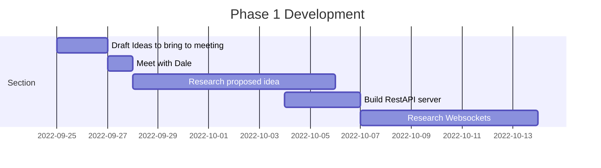
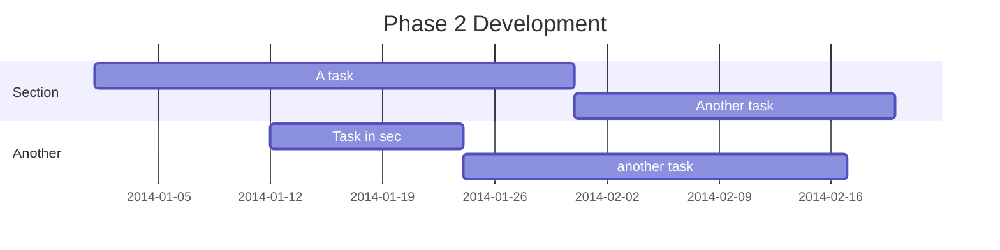

# Individual Project – Integrated Voting Within PowerPoint

## Acknowledgements
I would like to thank my amazing project supervisor Allan Callaghan for all his help and support throughout the project. I would also like to thank Sir Rojer Manwood’s school for their time and support while undertaking this project.

## Introduction
With our modern-day society with technology and our increasingly fast paced lifestyle, it is becoming difficult to hold the attention of students while teaching. The aim of this project is to increase interactivity within lessons, without having to break the flow of the lesson, which could introduce disruption and slow down learning. My application will be a web-based voting tool that can be implemented directly within a PowerPoint presentation. It will accept votes from students on their individual devices and they will appear live in an active presentation, no need to switch windows or utilise external tools.

## Problem Analysis
Discuss link to Sir rodger manwoods school

Buisness case. Open Source but could have a subscription element to it to incur revenue. Want it to be reasonably priced and accessible
### Literature review
Talk less teaching model.
### Existing Similar Solutions
Mentimeter, Poll everywhere, Kahoot

### User Stories
- As a Student I want to be able to see the question that I am voting on, on my device so that I do not have to look up at the screen, so that I can focus on the question at hand.

- As a classroom teacher, I would like to be able to add the vote to my presentations before the vote starts so that they are ready to be used in the lesson and can be added during my planning time.

- As a teacher I would like for the voting application to have a simple look, as to not distract students away from the focus of the lesson.

## Phase 1 Development

After the meeting with Dale, we were able to determine a tool that would complement his teaching. The proposed idea was to make a voting system that would work within PowerPoint and would display feedback from students live within the presentation. We were unsure whether to make the method of voting a hardware-based device or a web-based client, but eventually settled on a web-based client due to the complexity and cost of a hardware-based solution.

The first issue I encountered was being able to import webpages into PowerPoint. In older versions of PowerPoint using embedded objects was supported but has since been discontinued and made obsolete. I looked into using add-ins to PowerPoint to display pages but most of them were either for unsupported versions of PowerPoint, or just did not work. I did not like this solution much although due to the nature of having to install and trust someone else’s software within a sensitive environment like a school. Eventually I found the Microsoft Add-In “Web Viewer” although this did not come without its own challenges as you will see as you continue.

With Web Viewer added to my PowerPoint installation, I was ready and excited to start. Before I installed Web Viewer, I had read some of the reviews contributing to the 1.9 out of 5 stars it has on the Microsoft store. “Doesn’t work with basic sites”, “Waste of time” and “Next to useless” (Microsoft Corporation, 2023) were just a few of the reviews I read. I wanted to ensure that I wasn’t going to have the same experience that those users had, so I loaded up a blank presentation, added the add in and typed in www.google.com. Nothing. Maybe it doesn’t work with search engines I thought, so I navigated to https://www.canterbury.ac.uk/ still nothing. I had a problem. I noticed that it had a default URL in the search bar of https://www.wikipedia.org/ so I tried that. It worked. 

Now I just had to figure out why that worked, and the others didn’t. I made a basic Hello world webpage and hosted it on a webserver that supported HTTPS. There it was it showed up. 
Ensuring Web Viewer Supported WebSocket’s was critical for my project, I added a simple Web Socket script to my Hello World page, that would just display on the page what it received. I sent the message and nothing. I tried it on my browser, and it worked. Web Viewer has no developer tools and no console, so I had no method of any feedback as to why it was not working. After a lot of trial and error I worked out that it required secure WebSocket’s. After setting up a domain to utilise secure WebSocket’s the messages appeared within Web Viewer.

## Phase 2 Development

## Phase 3 Development

## Conclusion
I think even though this project didn't reach all of its goals, I still belive it was a huge sucess, as its main aim was to aid in learning, and throughout this project I have learnt many new skills 

## Refrences