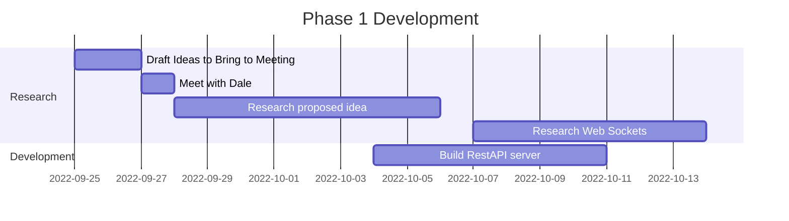

# Individual Project – Integrated Voting Within PowerPoint

## Acknowledgements

I would like to thank my amazing project supervisor Allan Callaghan for all his help and support throughout the project. Thank you also to Sir Rodger Manwood's School for allowing me to work with them on this project.

## Table of Contents

- [Individual Project – Integrated Voting Within PowerPoint](#individual-project--integrated-voting-within-powerpoint)
  - [Acknowledgements](#acknowledgements)
  - [Table of Contents](#table-of-contents)
  - [Abstract](#abstract)
  - [Introduction](#introduction)
  - [Problem Analysis](#problem-analysis)
    - [Scope of the project](#scope-of-the-project)
    - [Literature review](#literature-review)
      - [Talk less Teaching](#talk-less-teaching)
      - [Technology and the Modern Classroom](#technology-and-the-modern-classroom)
    - [Existing Similar Solutions](#existing-similar-solutions)
      - [Mentimeter](#mentimeter)
      - [Poll Everywhere](#poll-everywhere)
      - [Kahoot](#kahoot)
    - [User Stories](#user-stories)
  - [Phase 1 Development](#phase-1-development)
    - [Phase 1 Evaluation](#phase-1-evaluation)
  - [Phase 2 Development](#phase-2-development)
    - [Phase 2 Evaluation](#phase-2-evaluation)
  - [Phase 3 Development](#phase-3-development)
  - [Final Deliverable](#final-deliverable)
    - [Evaluation](#evaluation)
    - [Future Work](#future-work)
  - [Conclusion](#conclusion)
  - [References](#references)
  - [Appendices](#appendices)
    - [Links to Repositories](#links-to-repositories)
    - [Meeting Notes](#meeting-notes)
    - [Communication History](#communication-history)

## Abstract

## Introduction

With our modern-day society with technology and our increasingly fast paced lifestyle, it is becoming difficult to hold the attention of students while teaching (Consumer Insights, 2015). The aim of this project is to increase interactivity within lessons, without having to break the flow of the lesson, which could introduce disruption and slow down learning. My application will be a web-based voting tool that can be implemented directly within a PowerPoint presentation. It will accept votes from students on their individual devices and they will appear live in an active presentation, no need to switch windows or utilize external tools.

## Problem Analysis

This solution was conceptualized working with the head of ICT at Sir Rodger Manwood's secondary school. He wanted a way to increase interactivity within his lessons, without having to break the flow of the lesson, which could introduce disruption and slow down learning. A tool to be able to ask questions to his students and get live feedback from them, without having to switch windows or utilize external tools.

### Scope of the project

This is not only a good solution for just our client, but could be useful for teachers around the country. With PowerPoint being a staple in the modern classroom, this tool would easily integrate within the teachers current workflow and minimal additional knowledge would be required to use it. This is hugely beneficial as with marking and planning teachers have very little time to learn new tools and software.

To enable software to reach as many users as possible this software would be free with available extras at a monthly cost. Examples of some of extras could be, an unlimited amount of questions being created a day, or the ability to customize the color scheme to better suit the presentation. This would generate ongoing revenue for the company and would allow for the software to be maintained and updated.

### Literature review

#### Talk less Teaching

The main concept behind 'Talk Less Teaching' is to increase the amount of time students are actively engaged in the lesson. This is done by reducing the amount of time the teacher is talking (Wallace, 2014). This gives the students time to not only absorb the information that has just been presented to them, but also develop their own understanding of the material.

#### Technology and the Modern Classroom

Why and how is technology being used in the classroom. What are the benefits of using technology in the classroom.

Yes the stakeholder does tell you what to do but the stakeholder tells you what path to go down.

### Existing Similar Solutions

Some commercial solutions are already pre-existing and an analysis of such can be found below.

#### Mentimeter

Mentimeter is a response tool that allows for the creation of interactive presentations. It allows for the creation of polls, quizzes, word clouds and more. It is a web-based application that has a free beginning tier, that has limitations on its usage but is available as a paid service (Iona,2018).

#### Poll Everywhere

#### Kahoot

Mentimeter, Poll everywhere, Kahoot

### User Stories

- As a Student I want to be able to see the question that I am voting on, on my device so that I do not have to look up at the screen, so that I can focus on the question at hand.

- As a classroom teacher, I would like to be able to add the vote to my presentations before the vote starts so that they are ready to be used in the lesson and can be added during my planning time.

- As a teacher I would like for the voting application to have a simple look, as to not distract students away from the focus of the lesson.

- As a teacher I would like to be able to see the results of the vote in real time, so that the students can see their votes having an impact on the final tally.

- As a student I would like a qr code to take me to the website, so that it is easily accessible from my mobile device without having to type in a long URL.

- As a student with visual impairments, I would like for the voting application to be as readable as possible so that I can easily see the question and the options.

## Phase 1 Development

[//] # write about hardware, eg. phones computers. What version of powerpoint does it actually work on?

After the meeting with Dale, we were able to determine a tool that would complement his teaching. The proposed idea was to make a voting system that would work within PowerPoint and would display feedback from students live within the presentation. We were unsure whether to make the method of voting a hardware-based device or a web-based client, but eventually settled on a web-based client due to the complexity and cost of a hardware-based solution. This means students would use their phones or computers to interact with the vote.

The first issue I encountered was being able to import webpages into PowerPoint. In older versions of PowerPoint using embedded objects was supported but has since been discontinued and made obsolete.

Researching ways to display webpages within PowerPoint was the first step. I found several executables online that promised to add live webpage functionality within Powerpoint, but they all seemed to only work with older versions of PowerPoint, which would have been no use to me as they were obsolete. I did not like this solution much also, due to the nature of having to install and trust someone else’s software within a sensitive environment like a school. This was when I stumbled upon the add in for PowerPoint called "Web Viewer" an official microsoft extension. The add-in promised to work with the latest version of PowerPoint which was perfect for my use case. Due to it being an official microsoft add-in, it was easily installable from the add-in store in PowerPoint. This I felt like was the most appropriate route to take, in terms of user experience, ease of installation and security.

With Web Viewer added to my PowerPoint installation, I was ready and excited to start. Before I installed Web Viewer, I had read some of the reviews contributing to the 1.9 out of 5 stars it has on the Microsoft store. “Doesn’t work with basic sites”, “Waste of time” and “Next to useless” (Microsoft Corporation, 2023) were just a few of the reviews I read. I wanted to ensure that I wasn’t going to have the same experience that those users had, so I loaded up a blank presentation, added the add in and typed in "www.google.com". Nothing. Maybe it doesn’t work with search engines I thought, so I navigated to "www.canterbury.ac.uk" still nothing. I had a problem. I noticed that it had a default URL in the search bar of "www.wikipedia.org" so I tried that and it worked. Now I just had to figure out why that worked, and the others didn’t. I made a basic Hello world webpage and hosted it on a web server that supported HTTPS. There it was it showed up. I knew I could display a webpage of some kind in PowerPoint, even if it was just a simple text page. This was a start.

Moving onto the RestAPI implementation, it went quite well. I chose to use FastAPI for my framework choice as it had robust Websocket support, its good performance due to its use of Starlette and in-built error handling. I created 2 POST endpoints and a Websocket endpoint. The first POST endpoint was for creating a new vote, it would take in a JSON object with the question and the options. The second POST endpoint was for submitting a vote. The websocket connection would not just tell the client there was a new vote, it would send the total vote count every time. This was done to reduce processing on the client side due to it being within a PowerPoint presentation.

Ensuring Web Viewer Supported WebSocket’s was critical for my project, I added a simple web socket script to my Hello World page, that would just display on the page what it received. I sent the message and nothing. I tried it on my browser, and it worked. Web Viewer has no developer tools and no console, so I had no method of any feedback as to why it was not working. After a lot of trial and error and a lot of researching, I worked out that it required secure WebSocket’s. This was a huge setback as I now had to understand how to implement secure websockets. After a lot more research I was ready to try it with secure websockets and it worked. I was able to send a message from the server to the client and display it on the page. This was a huge milestone for me as it meant I could now send data from the server to the client. This meant my project was now possible.

### Phase 1 Evaluation

Looking back at the progress made in Phase 1, it was not as substantial as I first thought it was going to be. My inexperience in accurately sizing tasks to be completed led me to be over ambitious with the amount of work I could complete in the time frame. I was able to complete the research into the proposed idea and the research into the technology that would be used. I was also able to complete the development of the RestAPI server that would be used to send the data to the PowerPoint client.

Issues began to arise in actually being able to display a webpage within Powerpoint. Working with microsoft's add-ins was completely new to me, and I naively assumed that it would work just like any other web browser would. This was not the case and as such had huge knock-on effects to the progress of the project as I was trying to overcome issues.

## Phase 2 Development

For this phase of development, I was focused on getting an interface functioning within powerpoint that would react to incoming data, as this was such a critical aspect of the project. I started off by mocking up a design that I would like for the final implementation to look similar too. This was mocked up inside a PowerPoint window to be able to really judge how the final design would look. This mockup can be seen below.

<i>Figure 1: PowerPoint client design mockup</i>

I felt this design had some advantages based on our target audience, including:

- The question is boldest and located at the centre of the design, where yours eyes are drawn to first. This keeps the focus on the question and not the results.
- There are clear instructions at the top of the design, instructing the users on how they can participate in the vote. The instructions are clear and simple as to not cause any ambiguity.
- The use of the auto-generated QR code allows for easy access to the voting page, without having to type in a long URL. This is a huge advantage not only for the students in terms of ease of access but also for the teacher as it reduces the amount of time spent on trying to navigate to the voting page.
- The design dedicates half of the page to a graph displaying the outcome of the vote, this makes it not only easy for the students and teacher to see the progress of the vote, but for the teacher to discuss the outcome of the vote with the class in greater depth if necessary.
- All fonts are a fork of the sans-serif font Helvetica ensuring that students with low vision can still read the text clearly (Buultjens, 1999). The colors of the graph are distinct and bold so that they can easily be distinguished from one another.

I planned on using Chart.js for the live charts and wanted to ensure that worked also. I added the example to my Hello world page and loaded it. Nothing but a blank screen again. I tried it in my browser on my computer and there it was displaying; this was another Web Viewer issue.

After digging around in the Web Viewer menus I discovered that it uses, Microsoft edge version 1.9.0.0, an old and no longer supported browser. Because of this it did not contain all the latest features in modern browsers such as Web Workers which was utilised within the Chart.js library.

After much anguish and frustration, trying to look for a new library that would be compatible with this antiquated browser, I was able to discuss my issue with one of my peers who suggested using an older version of the Chart.js library. Working backwards from the latest version of Chart.js (Version 4) I was able to find a version that was compatible with the browser (Version 2).

Now that I was able to display charts within powerpoint, I had to be able to take in the votes from the websocket connection. This was new for me understanding how to take in data from a websocket connection, but after a little research I was able to get the graph moving to the incoming votes.

Once I had the ability to manipulate the graph with votes it was time for the finishing touches on the powerpoint client. This included using an API that takes in a url and returns a QR code image. and the title being to the right and the voting to the left. This was all done using HTML and CSS. After it was all done I am pretty impressed with the final result especially with how close it resembles the mockup. This can be seen below.

<i>Figure 2: PowerPoint client Final Implimentation</i>

### Phase 2 Evaluation

After another setback due to the limitations of Web Viewer, I was able to get a working interface that would react to incoming data. This however took far longer than I originally anticipated, which again had a knock on affect of the progress of the project. This combined with trying to fix issues that were not addressed within the previous phase put me behind schedule.

This again highlights my inexperience when it comes to weighting tasks as I thought that it would take far less time than it actually did. This further set me back than I had anticipated, and I was not able to complete as much as I would have liked to in this phase.

## Phase 3 Development

## Final Deliverable

I present to you, Votley. The integrated voting system for powerpoint.

### Evaluation

### Future Work

## Conclusion

I think even though this project didn't reach all of its goals, I still believe it was a huge success, as its main aim was to aid in learning, and throughout this project I have learnt many new skills

## References

- Microsoft Corporation, 2023. Web Viewer. [Online] Available at: <https://appsource.microsoft.com/en-us/product/office/WA104295828?tab=Reviews&exp=ubp8#>
 (Accessed on 2023-04-25)
- Consumer Insights, 2015. Attention spans, s.l.: Microsoft Canada, Spring.
- Wallace, I., 2014. Talk-less teaching: practice, participation and progress. Crown House Publishing.
- Buultjens, M., Aitken, S., Ravenscroft, J. and Carey, K., 1999. Size counts: The significance of size, font and style of print for readers with low vision sitting examinations. British Journal of Visual Impairment, 17(1), pp.5-10.
- Iona, J., 2018. Mentimeter. School Librarian, 66(3), pp.153-154.

## Appendices

### Links to Repositories

- [GitHub Repository](https://github.com/Joshua-Yuill/Votley_Final-Year-Project)

### Meeting Notes

### Communication History
