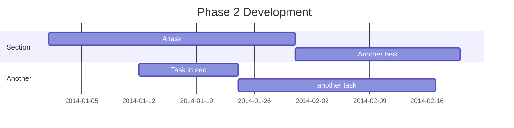

# Individual Project – Integrated Voting Within PowerPoint

## Introduction
With our modern-day society with technology and our increasingly fast paced lifestyle, it is becoming difficult to hold the attention of students while teaching. The aim of this project is to increase interactivity within lessons, without having to break the flow of the lesson, which could introduce disruption and slow down learning. My application will be a web-based voting tool that can be implemented directly within a PowerPoint presentation. It will accept votes from students on their individual devices and they will appear live in an active presentation, no need to switch windows or utilise external tools.

## Problem Analysis
### Literature review
Talk less teaching model.
### Existing Similar Solutions
Mentimeter, Poll everywhere, Kahoot

### User Stories
- As a Student I want to be able to see the question that I am voting on, on my device so that I do not have to look up at the screen, so that I can focus on the question at hand.

- As a classroom teacher, I would like to be able to add the vote to my presentations before the vote starts so that they are ready to be used in the lesson and can be added during my planning time.

- As a teacher I would like for the voting application to have a simple look, as to not distract students away from the focus of the lesson.

## Phase 1 Development

## Phase 2 Development

## Phase 3 Development

## Conclusion
I think even though this project didn't reach all of its goals, I still belive it was a huge sucess, as its main aim was to aid in learning, and throughout this project I have learnt many new skills 

## Refrences